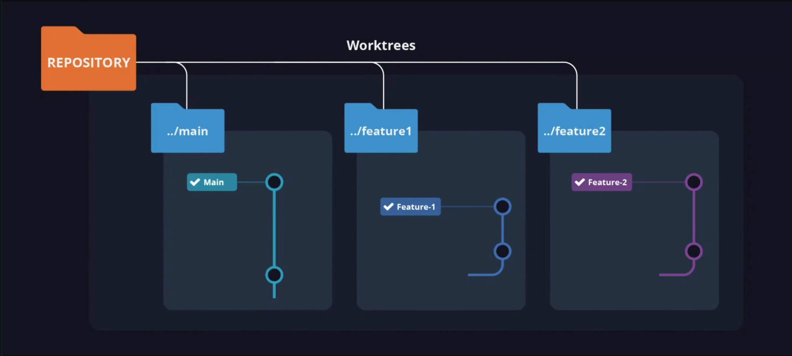

# From GitHub Issue to Tested Feature with Claude Code

This live session demonstrates how to use Claude Code as part of a realistic software development workflow on top of an existing production-style repository. The goal is not to generate code from scratch, but to show how Claude Code can help read a requirement, analyze an unfamiliar codebase, work safely in isolation, delegate tasks, validate implementation decisions, run tests, and produce a PR-ready outcome.

## Prerequisites

Before the live session, make sure you have:

- Python 3.11+
- `uv` installed locally
- Claude Code CLI installed locally
- Git installed locally
- Docker and Docker Compose available
- A GitHub account with access to create branches
- A local clone of `fastapi/full-stack-fastapi-template`
- A local clone or fork of this workshop repository

For the GitHub Actions audit flow, you need a GitHub repository where Actions can run.

## Local Setup

From the `full-stack-fastapi-template` repository root:

```bash
cd full-stack-fastapi-template
docker compose up --build
```

Once the containers are healthy, confirm the following endpoints are reachable:

| Service | Description | URL | Port |
|---------|-------------|-----|------|
| **Frontend** | React/Vue web application | http://localhost:5173 | 5173 |
| **Backend API** | FastAPI REST API | http://localhost:8000 | 8000 |
| **Backend Docs** | Swagger UI | http://localhost:8000/docs | 8000 |
| **Adminer** | Database administration UI | http://localhost:8080 | 8080 |
| **Mailcatcher** | SMTP testing server (web UI) | http://localhost:1080 | 1080 |

Install backend dependencies for local test and lint commands:

```bash
uv sync
```

Verify the test suite is ready:

```bash
cd backend
pytest tests/api/routes/test_items.py --collect-only | head -n 5
```

## Before you start

* For using claude code through ollama models: [Claude Code usage with Ollama](https://docs.ollama.com/integrations/claude-code).
* 


## Live Session Guide

### 1. Review the repository structure

Start by reading the files that define the app and the expected behavior:

- `backend/app/main.py`
- `backend/app/api/routes/items.py`
- `backend/app/crud.py`
- `backend/app/models.py`
- `backend/tests/api/routes/test_items.py`

Current structure:

- `backend/app/` contains the FastAPI app, routes, models, CRUD layer, and service layer.
- `backend/tests/` contains API and service tests.
- `.claude/` contains Claude Code settings, hooks, and agent definitions.
- `.github/workflows/` runs CI on GitHub.
- `CLAUDE.md` defines project-specific instructions for Claude Code.

### 2. Baseline: run tests locally

Run:

```bash
cd backend
pytest tests/api/routes/test_items.py -q
```

For the demo, the tests should pass first. This green baseline is the starting point for every feature we will add.

### 3. Generate feature proposals in isolated worktrees

Before writing code, identify small, realistic feature requests. Use Claude Code worktrees to keep each proposal isolated.

Open a separate Claude Code session in worktree mode:

```bash
cd full-stack-fastapi-template
claude --worktree
```

Inside the worktree session, delegate the analysis task:

```text
Analyze the repository and create four isolated worktrees.
In each worktree, write a PROPOSAL.md that describes a single GitHub issue or feature request
suitable for a 15-minute live coding session. Keep each proposal brief: state the problem,
list 3-5 acceptance criteria, and note non-goals. Do not describe the full solution yet.
Reference the repository README for scope guidance.
```

Expected result: four directories under `.claude/worktrees/`, each containing a `PROPOSAL.md` with a clear issue title, a short problem statement, numbered acceptance criteria, and explicit non-goals.

Verify the created worktrees:

```bash
git worktree list
```

Example worktrees for this session:

- `proposal-item-search`
- `proposal-item-sorting`
- `proposal-item-stats`
- `proposal-soft-delete`

**Teaching point:** Worktrees let you explore multiple ideas in parallel without polluting the main working tree. Each `PROPOSAL.md` acts as a contract: it defines what will be built before implementation starts.

### 3a. Understanding Git Worktree mechanics

> Git worktree allows you to have multiple working directories for the same repository, each checked out to a different branch. Think of it as multiple copies of your project that all share the same Git history.


*[Claude Code Worktrees in 7 Minutes](https://www.youtube.com/watch?v=z_VI51k-tn0&t=85s)*

`claude --worktree` automates what you would otherwise do manually:

```bash
# Create a worktree manually
git worktree add ../project-feature-a

# Start Claude in that directory
cd ../project-feature-a && claude

# Clean up when done
git worktree list
git worktree remove ../project-feature-a
```

**Teaching point:** `claude --worktree` handles branch creation, directory setup, and isolation automatically. Each worktree is a complete directory where you can edit, test, and commit without affecting other worktrees.

### 4. Select one proposal and enter its worktree

For the live demo, pick one proposal. Example: `proposal-item-search`.

Enter the worktree:

```bash
claude --worktree proposal-item-search
```

Verify isolation:

```bash
git branch --show-current
pwd
git worktree list
git status
```

Read the acceptance criteria before any code is written:

```bash
cat PROPOSAL.md
```

Confirm the proposal contains:

1. A concrete endpoint or feature target.
2. 3-5 acceptance criteria.
3. Explicit non-goals or scope boundaries.
4. A reference to the files likely to change.

### 5. Explore the codebase before changing anything

This step is important because participants should see that Claude Code is used to understand a codebase before editing it.

Suggested prompts for the live session:

- "Summarize the backend architecture relevant to this endpoint."
- "Identify the files involved in adding filtering and pagination to this route."
- "List the tests that should change if we implement this feature."

Run exploratory commands:

```bash
find backend -maxdepth 3 -type f | head -n 30
```

Expected exploration targets:

- `backend/app/api/routes/`
- `backend/app/models.py`
- `backend/app/crud.py`
- `backend/tests/api/routes/`

Teaching point: Claude Code should narrow scope before any file is modified.

### 6. Delegate implementation to subagents

Divide the work into specialized roles instead of one long monolithic prompt.

Recommended roles:

1. **Planner** — interpret the issue, define scope, identify files to edit.
2. **Implementer** — modify the code, preserve repository conventions, avoid unrelated changes.
3. **Tester** — add or update automated tests, identify edge cases.
4. **Reviewer** — inspect the result, check for regressions or missing coverage.

Action: Explain each role before delegation. Show at least one concrete delegation example in the live session.

Example subagent invocation:

```text
Use the issue-scope-planner agent to analyze the issue, inspect the codebase, identify relevant
route handlers, CRUD functions, models, and test files, and define the precise scope before any
coding begins.
```

### 7. Use Context7 selectively

Use Context7 only when a question cannot be answered confidently from the local codebase.

Good examples:

- FastAPI query parameter patterns.
- Pagination parameter conventions.
- Pydantic validation behavior.
- pytest fixture or test style examples.

Bad example: querying documentation for patterns already obvious from the repository itself.

Action:

1. Identify a concrete uncertainty.
2. Query Context7 for that exact point.
3. Apply the result conservatively.

Teaching point: documentation lookup should support implementation, not replace reasoning.

### 8. Enforce scope with hooks

Hooks should be presented as workflow constraints, not decoration.

#### Hook 1: Scope reminder

Runs before every user prompt to keep allowed paths visible.

Configuration in `.claude/settings.json`:

```json
{
  "name": "scope-reminder",
  "command": "bash .claude/hooks/scope-reminder.sh",
  "timeout": 5000
}
```

#### Hook 2: Scope guard

Runs after every tool use to detect out-of-scope changes.

Configuration in `.claude/settings.json`:

```json
{
  "name": "scope-guard",
  "command": "bash .claude/hooks/scope-guard.sh",
  "timeout": 10000
}
```

#### Hook 3: Backend validation

Runs after every tool use to lint modified Python files.

Configuration in `.claude/settings.json`:

```json
{
  "name": "backend-validation",
  "command": "bash .claude/hooks/backend-validation.sh",
  "timeout": 30000
}
```

Action:

1. Explain the purpose of each hook.
2. Show the configuration or pseudo-configuration.
3. Trigger behavior at least once if possible.

If hook support is not stable in your environment, present this section as a conceptual design and show the equivalent validation commands manually.

### 9. Implement the feature

At this point the instructor should already have:

- a defined issue
- a scoped plan
- a worktree
- a set of subagent roles
- any necessary documentation lookup
- hook constraints or an equivalent validation plan

Now implement the feature in the backend.

Typical files likely involved in this repository:

- `backend/app/api/routes/items.py`
- `backend/app/crud.py`
- `backend/tests/api/routes/test_items.py`

Action:

1. Update the route or query logic.
2. Add filtering and pagination parameters.
3. Validate invalid inputs using the repository's existing conventions.
4. Preserve existing naming, response, and test patterns.

Suggested narration:

> We are not trying to invent a new architecture. We are extending the existing design in the smallest coherent way.

### 10. Run local validation

This step should be explicit and visible. The audience should see that changes are validated, not just assumed to work.

At minimum, run targeted tests for the affected backend area:

```bash
cd backend
pytest tests/api/routes/test_items.py -q
```

If the repository requires containerized commands, use the appropriate local equivalent instead:

```bash
./scripts/test.sh
./scripts/test-local.sh
```

Optional additional validation:

```bash
./scripts/lint.sh
./scripts/format.sh
```

Review the diff before committing:

```bash
git diff --stat
git diff
```

Checklist:

- Only the intended files appear in the diff.
- No unrelated formatting or refactoring is mixed in.
- Test additions are visible.

Teaching point: a clean diff is a reviewable diff. If the diff contains surprises, revert and redo.

### 11. Consolidate all features and push to the current branch

After all four issues are solved in their respective worktrees:

1. Exit each worktree and return to the main working tree.
2. Merge or apply the changes from each worktree branch into the current branch.
3. Resolve any conflicts if the same files were touched.
4. Run the full test suite one final time.
5. Push the consolidated current branch to the remote.

```bash
git worktree list
git checkout main
git merge proposal-item-search
git merge proposal-item-sorting
git merge proposal-item-stats
git merge proposal-soft-delete
pytest tests/
git push origin main
```

PR summary structure:

1. What changed (all four features).
2. Why it changed.
3. Tests added or updated.
4. Known limitations.

### 13. Wrap up the main takeaway

Close with the core message of the session:

> Claude Code is not only useful for generating code. It is useful for orchestrating a safe, auditable, real development workflow.

Reinforce the five main ideas:

1. **Isolate** with worktrees and a local `PROPOSAL.md`.
2. **Delegate** with subagents.
3. **Validate** with tests and hooks.
4. **Audit** with GitHub Actions.
5. **Consolidate** and push all completed features to the current branch.

## How the Session Workflow Works

This session demonstrates three complementary layers:

1. **Local development with Claude Code:**
   Read a GitHub issue, explore the codebase, isolate work in a Claude Code worktree, delegate to subagents, validate with tests, and produce a clean diff.

2. **Hooks as guardrails:**
   Configure `beforeUserPromptSubmit` and `afterToolUse` hooks to remind about scope, guard against out-of-scope edits, and run fast validation after every change.

Important rules for all modes:

- Do not edit before identifying the relevant route, model, CRUD, and test files.
- Prefer extending existing architecture over inventing new abstractions.
- Preserve naming, validation, and response patterns already used in the codebase.
- Avoid unrelated refactors unless the issue explicitly requires them.

## Challenge for Students

### Objective

Reproduce the same workflow on a small variation of the live task. Each student must take four small backend requirements, implement each in isolation with Claude Code, validate them with tests, and consolidate the changes into a single push to the current branch.

### Deliverables

Each student should submit:

1. The issue statements or feature requests they worked from.
2. The Claude worktree names they used and the path to each `PROPOSAL.md`.
3. The list of files they changed.
4. The test commands they ran.
5. Proof that the consolidated branch was pushed to the remote.
6. A short PR-style summary.

### Step-by-Step Assignment

#### 1. Choose an endpoint

Select an existing backend endpoint in `fastapi/full-stack-fastapi-template` or in another approved repository.

#### 2. Define four feature requests

For each feature request, write 3 to 5 acceptance criteria. Examples:

- add a new query filter to an existing endpoint
- add pagination parameters to a list endpoint
- add a validation rule for invalid input
- add one missing negative test case to an existing route
- improve response handling for an edge case already covered by the codebase patterns

#### 3. Create a Claude Code worktree for each task

```bash
claude --worktree feature-a
claude --worktree feature-b
claude --worktree feature-c
claude --worktree feature-d
```

#### 4. Write a PROPOSAL.md in each worktree

Each `PROPOSAL.md` must document:

- the issue and acceptance criteria
- the expected files to change
- explicit non-goals

#### 5. Explore before editing

Before modifying any file, ask Claude Code to identify the relevant route, model, CRUD, and test files.

#### 6. Delegate to subagents

Use at least one subagent or delegated role per feature. Example roles:

- `issue-scope-planner`
- `code-implementer`
- `fastapi-test-writer`
- `regression-coverage-reviewer`

#### 7. Use Context7 only when needed

If you hit a real uncertainty about FastAPI, Pydantic, or pytest behavior, query Context7. Do not query documentation for patterns already visible in the repository.

#### 8. Keep changes scoped

Each change should be limited to the minimum necessary files. Hooks or manual checks should enforce this.

#### 9. Add or update automated tests

Every feature must have tests that run with a single command:

```bash
cd backend
pytest tests/api/routes/test_items.py -q
```

#### 10. Validate locally in each worktree

Run tests and, if available, lint checks before exiting the worktree.

#### 11. Consolidate and push

Once all four features are solved:

```bash
git checkout main
git merge feature-a
git merge feature-b
git merge feature-c
git merge feature-d
pytest tests/
git push origin main
```

#### 12. Produce a PR summary

The summary must include:

- what changed
- why it changed
- how it was tested
- what remains uncertain

### Success Criteria

You pass the assignment if your repository demonstrates all of the following:

- Four issues with explicit acceptance criteria.
- Each feature is implemented inside its own Claude worktree with a local `PROPOSAL.md`.
- At least one subagent delegation per feature.
- Context7 is used selectively, not as a replacement for reasoning.
- Hooks or equivalent guardrails are configured or described.
- Tests are run locally in each worktree.
- GitHub Actions is shown as the audit layer.
- All four features are consolidated and pushed to the current branch.
- A PR-style summary is produced at the end.

### Bonus

Configure a GitHub Actions workflow that fails if files outside `backend/app/**` and `backend/tests/**` are modified in a pull request.

## Reference

- [Git worktree + Claude Code: My Secret to 10x Developer Productivity](https://dev.to/kevinz103/git-worktree-claude-code-my-secret-to-10x-developer-productivity-520b)
- [Claude Code Worktrees in 7 Minutes](https://www.youtube.com/watch?v=z_VI51k-tn0&t=85s)
- [Claude Code Hooks Reference](https://code.claude.com/docs/en/hooks)
- [Claude Code Cheat Sheet](https://academy.dair.ai/claude-code-cheat-sheet)
